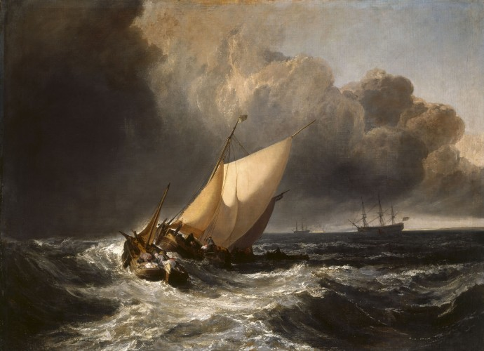
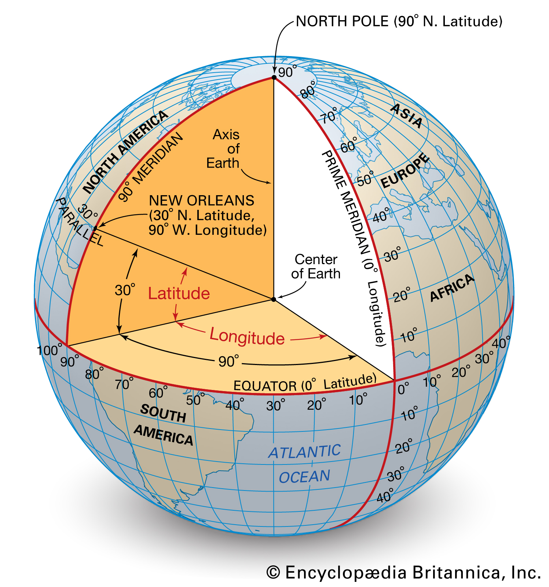

# Chapter 2: Thinking Geo

_Part 2 of A Programmer's Guide to Spatial Data_


Where am I? 
- Latitude
- [Longitude](./2-THINKING-GEO.md#longitude)
- Representing coordinates
    - Precision
- Bearing
- 3D -> 2D: projections

Fast forward: 
- GNSS. TopoNet?
- Coordinate reference systems
    - SRS, CRS, projection, datum, etc.

Representing Spatial Data

Raster
- Definition
    - What is an "observation"?
- Georeferencing
- Tiles
- Examples
    - DEM
    - Hillshade
    - Satellite
    - Rendered cartography
    - Heatmaps
- Alternative grids
    - Hex (hexbin, uber)
    - Triangle 
- Uses
    - Overlay: intensity
    - Satellite imagery
    - etc

Vector
- Definition
    - What is an "observation"?
- "Features"
    - Feature types
        - Points
        - Lines
        - Polygons
        - Multi*
        - FeatureCollections
    - Attribution / properties
    - Topological relationships
- "Layers"
    - A thematic (?) grouping of features
    - Example

---

In [Part 1 of A Programmer's Guide to Spatial Data](./0-INTRODUCTION.md), we looked at how useful maps can be and introduced the concept of spatial data, which is any data that contains information about **where observations are**. We also introduced the two main ways of representing spatial data: a **raster dataset** is a regularly-spaced grid of cells or pixels with assigned values, and a **vector dataset** uses coordinate pairs or sequences of coordinate pairs to represent point, line and / or polygon features. 

Part 2 will dive deeper into the fundamental concepts that underpin location data, key ideas to understand to approach a spatial data analysis or visualisation task. We'll look at how some of the nuances of  coordinates and coordinate reference systems, projections, and we'll dig a bit deeper into raster and vector data. 

## Where Am I?

Accurately working out where we are on the Earth was one of the most difficult problems humans faced for millennia. Knowing where we are is the first step to deciding where we are going. For travellers - and especially mariners, who often had no fixed points of reference to orient themselves by other than the stars - the task of locating one's self was often a matter of life and death. 



_[Dutch Boats in a Gale](https://www.nationalgallery.org.uk/paintings/joseph-mallord-william-turner-dutch-boats-in-a-gale-the-bridgewater-sea-piece), by J.M.W. Turner, 1801, oil on canvas._

[ ***something else here? ]

The Earth is round, but it is not a perfect sphere. It is a bit squashed - a shape called an "ellipsoid" - and it's lumpy, with mountains and valleys and sea mounts and so on, with different areas having different densities - more accurately, a "[geoid](https://en.wikipedia.org/wiki/Geoid)". The planet rotates on its vertical axis. 


### Latitude

Imagine a line running through the diameter of a sphere along its vertical axis, connected by a line encircling the horizontal circumference of the sphere (called a meridian). From the center of the sphere - the midpoint of this diameter line - we can specify any _latitude_ - any position north or south of the equator on the sphere's surface. Latitude is represented as an angle, from 0° - a horizontal line out from the sphere's center point to the equator - to 90°, a vertical line to the north or south pole.

[ image - or embedded observable notebook? - here - click to get radial angle ] 

As it turns out, latitude is _relatively_ easy to calculate by measuring the position of the sun at noon or the North Star or the Southern Cross above the horizon and doing some trigonometry, adjusting for the time of year. [ more here on calculating latitude? - or link to a video like this one: https://www.youtube.com/watch?v=luwRQecuNpA ] 

[ image of getting latitude from north star ]

### Longitude

Longitude, on the other hand, is quite a bit trickier to measure. This is largely because there is no "East pole" or "West pole". Instead, we have decided to use one of the meridians as the origin, reference meridian - the "Prime meridian", running through Greenwich, UK and the outskirts of Accra, Ghana, dividing the Eastern and Western hemispheres.  

Again, longitude is described in degrees of the angle between the radius running from the Prime meridian to the center of the Earth and the radius to the position we're measuring. As we move east from 0°, degrees increase up to 180°, and as we move west from 0°, degrees decrease to -180°, until they meet at the antimeridian - the boundary between the Eastern and Western hemispheres in the Pacific Ocean.


_Latitude and longitude, from [Encyclopaedia Britannica](https://www.britannica.com/science/latitude#/media/1/331993/109269)._

Finding longitude requires the navigator to calculate the time difference between their position and a known position. As the Earth rotates 360° every 24 hours, by working out this time difference it is easy to compute how far east or west of the reference point someone is: 360° / 24 hrs = 15° per hour. It takes 4 minutes for the Earth to rotate 1°.

Reliably keeping time on a moving ship is a tricky thing due to motion and changing environmental conditions, explaining the long, interesting history of the quest to build an accurate clock. For more on the history of longitude and John Harrison's efforts to design this clock, we recommend [Longitude](https://en.wikipedia.org/wiki/Longitude_(book)) by Dava Sobel.

With longitude and latitude - the `x` and `y` coordinates - we can describe any point on the Earth's surface. 

> ⚠️: Note how this differs from the linguistic convention - usually we refer to "latitude and longitude" when speaking, which breaks from the mathematical convention of ordering coordinates horizontal (x), then vertical (y). This is a constant bugbear for developers. There is no universally-agreed standard for ordering coordinates, so different programming tools / systems represent coordinates inconsistently - some as `[x,y]`, some as `[y,x]`. If your coordinates aren't showing up, or are in the wrong part of the world - first thing is to check the coordinate ordering! More on this [here](https://macwright.com/lonlat/), including which formats, JS APIs and services use which order, from Tom MacWright. 

### Representing coordinates

We've established that we can describe any position on the surface of a sphere as a pair of coordinates that represent the horizontal and vertical angles of a line transecting that position from a reference radius, drawn to the intersection of the equator and the Prime Meridian. If you want more detail, see the [geographic coordinate systems article on Wikipedia](https://en.wikipedia.org/wiki/Geographic_coordinate_system).

[ ^^ needs to be more clearly and concisely stated ]

As with any unit of measurement, there are several ways to represent coordinates. Historically, latitudes and longitudes were represented in **degrees, minutes, seconds**. 

⚠️: Here, "minute" does not refer to a unit of time, but rather to a fraction of a degree. Referring to the angle measurements, 1° is divided into 60 minutes, represented as 60', and each minute is divided into 60 seconds, shown as 60". Coordinates are represented as `deg° min" sec' N/S, deg° min" sec' E/W` - Big Ben is located at 51°30'02.6"N 0°07'28.6"W.

This degree-minute-second format can be easy to understand in some contexts - but is not particularly easy for computers to work with. Instead, in most computing contexts coordinates are represented in decimal degrees - two float values. 

We can convert between the two formats - degrees minutes seconds and decimal degrees, based on the relationships we described above. In Python:

```python
degrees = 51
minutes = 30
seconds = 2.6
hemisphere = "N"

decimal_degrees = degrees + (minutes / 60) + (seconds / 3600)

if hemisphere == "S":
    decimal_degrees *= -1

print(decimal_degrees)
# 51.0007222222
```

Less frequently, you might find degrees measured in radians. A radian is "the measure of a central angle subtending an arc equal in length to the radius" ([dictionary.com](https://www.dictionary.com/browse/radian?s=t)). `1rad == 360 / 2π ≈ 57.2974693618`.

Converting from radians to decimal degrees - in JavaScript this time:

```javascript
var radians = 1.570797;
var decimalDegrees = radians * (360 / (Math.PI * 2));

console.log(decimalDegrees);
// 90.00003857181117
```

| Type | Example | 
| --- | --- |
| Decimal degrees `[lon, lat]` | `[-1.2314, 44.1243]` |
| Degrees, minutes, seconds - latitude, longitude | 44°7'27.48"N, 1° 13' 53.04"W | 
| Radians `(x, y)` | `(-0.0214920, 0.7701143)` |

### Bearing

_content here_
- Haversine distance
- Great circle route
- Triangulation

### 3D -> 2D: making maps

Working out that the Earth was (roughly) a sphere, and how to locate things on the surface of that sphere, was a major achievement for humanity, and resulted in huge advancements in the safety of navigation and seafaring, and in the accuracy with which we could map our world. 

But we haven't addressed a very significant challenge: how do we represent a spheroidal 3D object - the Earth - on a 2D plane - a paper map? The answer: to **reproject** the spherical coordinates to planar coordinates. This is a mathematical method for "flattening a continuous curved surface onto a plane" ([Wikipedia](https://en.wikipedia.org/wiki/Map_projection)). 

Of course, applying these mathematical transformations to the coordinates necessarily distort the positions of the points in relation to one another. Depending on the projection used - and we can think of a projection as a function which accept spherical coordinates, `[lon, lat]`, and returns planar coordinates, `[x, y]` - different areas will be distorted more or less; there is an art to choosing the right projection for your mapping use case. 

A full treatment of the topic of projections is beyond the scope of this guide. To begin working with spatial data, a few key things: 
- For much of the location data you'll work with on the web, geographic coordinates are provided - like `[-1.2314, 44.1243]`. These are *unprojected* coordinates, representing those points on the curved surface of the globe.
- Map tiles - both raster and vector tiles - are most usually projected, because they are representing geographic data on a 2-dimensional surface: your screen. The most common projection for map data is Web Mercator, EPSG:3587.
- WHAT IS EPSG?

Example function

D3 for reprojecting

proj4.*

... ? 

sdf

- Projections
- Working with projections
- Example function `f([lon, lat]) => [x, y]`

embed D3 projections example? 

https://www.youtube.com/watch?v=KUF_Ckv8HbE


## Fast forward to the 20th century

### GNSS

In the 21st century we no longer rely on measuring the position of the sun and stars to locate ourselves. In the past century, we have developed techniques using radio waves and other electromagnetic signals to work out the position of a receiver in relation to a few transmitters. 

To provide global localization services (the ability to provide a requester their geospatial position `[longitude, latitude, altitude]`), a few satellite constellations have been launched, and are constantly orbiting the Earth. These include the United States' [Global Positioning System](https://www.gps.gov/systems/gps/space/) (GPS), Russia's [GLONASS](https://en.wikipedia.org/wiki/GLONASS), the [European Union's Galileo network](https://en.wikipedia.org/wiki/Galileo_(satellite_navigation)) and China's [BeiDou](https://en.wikipedia.org/wiki/BeiDou) system, which saw its final satellite [launched in June 2020](https://www.economist.com/china/2020/07/18/chinas-home-grown-satnav-system-will-soon-be-fully-functional).

For a receiver - like a smartphone - to get an accurate position, it must establish a radio connection with at least four of the positioning satellites visible in the sky. These satellites have very accurate, syncrhonised clocks, as well as known orbital paths.

These positioning satellites transmit their position and the exact time on an interval. By measuring the amount of time it takes for a radio signal to travel from a satellite to the device being located, the physical distance between the transmitter and receiver can be calculated. (Radio waves are a form of electromagnetic radiation and travel at the speed of light.) Then, based on the known positions of the transmitters and the distances from each, a position can be determined for the receiver. 

This is all context to help developers understand _how_ these geographic coordinates are actually measured, since they form the basis of much of the spatial data we work with on the web - especially vector geometries.

### Coordinate Reference Systems

### More complexity: coordinate reference systems

Earlier we talked about how the Earth is not a perfect sphere - it is actually an irregular ellipsoidal shape called a geoid. Not only is the physical shape of this volume irregular - it also has variation in the density of the materials that form it. The density of a material impacts its gravitational effect - depending on where you are on Earth, and what you're standing on, you're subjected to imperceptible variations in gravitation pull.

For someone walking around, these variations in the Earth's shape and local gravity don't make a significant impact. But if we are trying to create a system for accurately measuring points on the Earth's surface, they do. 


#### Coordinate Reference Systems
- Geographic Reference Systems
- What it is and why it matters
- CRSs vs Projections
- 👍 - use Web Mercator. Or BNG? (I'd like this to be applicable to a global audience).
- Read more: [OS blog](https://www.ordnancesurvey.co.uk/blog/2016/09/ostn15-new-geoid-britain/), [more technical](https://www.ordnancesurvey.co.uk/documents/resources/guide-coordinate-systems-great-britain.pdf).

https://www.ordnancesurvey.co.uk/documents/resources/guide-coordinate-systems-great-britain.pdf

. <- Do we have OS graphics we want to use? 

#### Projections

#### Datum? SRS? What else?

## Representing Spatial Data

### Raster 
- Definition Grids of regular pixels, each pixel assigned numerical values.
    - Values could be RGB, elevation, multispectral satellite imagery etc.
    - What is an "observation"?
- Pixels are positioned in space - "georeferenced". 
- Mention formats: tif, png, jpg, cogs (cloud-optimized geotiff)
- Tiles as a concept
    - 
    - Fetching tiles as we zoom
- Examples
    - Digital elevation model 
    - Hillshade
    - Satellite
    - Rendered vector maps
    - Heatmaps and other raster maps
    - Opacity
- Alternative types of rasters - like hex, triangle grids etc.
- Uses - images, indices, etc. 
- Challenges: data size. Compute to data

### Vector
- Definition
    - What is an "observation" or "record"?
- "Feature".
    - Points, Lines, Polygons
        - Representing geometries: arrays of coordinate pairs.
        - Talk about Multi* / FeatureCollections (image) (types)
        - Complex polygons
    - Attribution / properties
    - Topology (contains, within, etc.)
- "Layer": collection of similar features  (?? multi-type layers?)
- Bounding boxes
- An aside: topojson and encoding topologies.