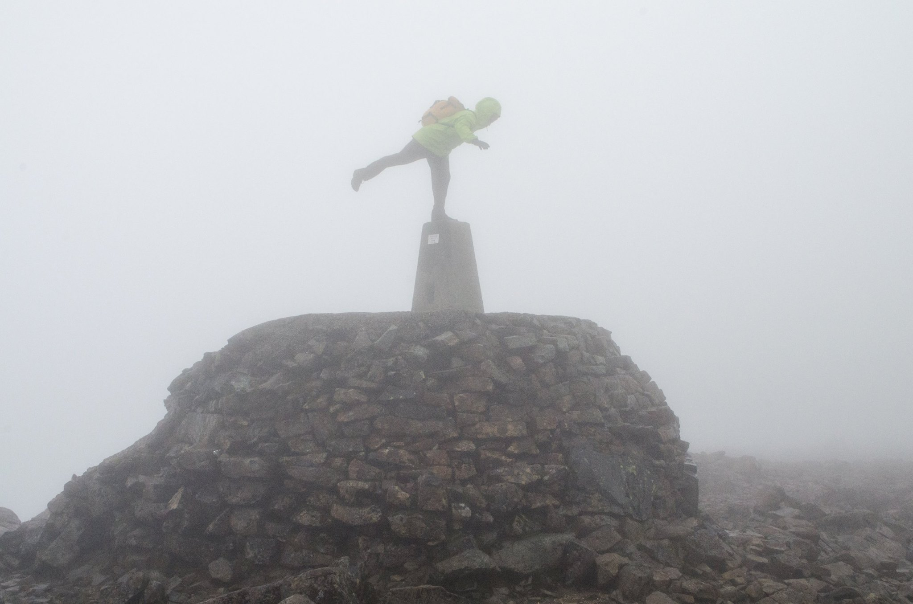

# Introducing OS's new Developer Advocate

Hi all 👋 - I'm John Hoopes, Ordnance Survey's new Developer Advocate. My job is to serve as a bridge between Ordnance Survey and the UK's developer community. I am here to help you all learn about the datasets OS is making available and how they might be useful to you, and to help OS better understand the needs of the amazing community of developers, data scientists and analysts using OS data. 

## The OS Developer Advocate

With the signing of the [Public Sector Geospatial Agreement](https://www.gov.uk/government/news/government-announces-new-10-year-public-sector-geospatial-agreement-with-ordnance-survey), Ordnance Survey is undergoing a major shift in the data it has on offer, and how that data is delivered to the user. Notably, several OS data products including open and premium raster and vector spatial datasets now can be accessed via APIs. 

This is a strategic decision meant to make these datasets available to a new market of users, and to ease the burden on existing users. The reason is simple: the UK government is committing to unlocking the full economic value from the detailed location information OS collects about Great Britain. 

What does this mean for you? If you're an existing OS data user, it means that you'll likely be accessing OS data in new ways, and that the licensing and royalties processes will be simplified. If you are a web developer, data scientist or GIS analyst who wants to make maps or analyse spatial data of Great Britain, a new suite of APIs is launching to serve up-to-date, high resolution vector and raster data from OS.  

I am incredibly fortunate to be the one tasked with helping the spatial data community here in the UK get up and running with these new APIs. I've been working with the team of OS cartographers and engineers to create developer-friendly content to help you get up and running with the Data Hub APIs. Specifically, we're adding more and more to our Examples page and publishing new Tutorials every few weeks. 

Beyond this technical content, I've been working with the team to interview OS data users from across sectors and industries. We've met with some amazing companies and learned about incredible projects like [CoronaFriend](https://www.coronafriend.com/), which helps neighbors support each other through the pandemic, and Alasdair Rae's stunning [3D renderings of Scotland](#). My job is to speak with innovative, intelligent people about how they use spatial data to improve decision-making and efficiency for people working in the public sector, for firms and for non-profits. 

Please do feel free to send a message and let me know what you're up to - I'm on [Twitter](https://twitter.com/johnx25bd) and [Github](https://github.com/johnx25bd/) under @johnx25bd, and my email is john.hoopes@os.uk.

## A bit about me

I've been working with location data in one form or another for over a decade - and if you count my youth poring over maps and exploring the mountains and coastlines of America, much longer. A windscreen tour:

**1987 - 2006:** Grew up in Colorado, served as a volunteer ski patroller, earned my Eagle Scout, and was lucky to do lots of hiking and adventuring all over America.

**2006 - 2010:** Earned a BSc Biology and Environmental Studies at Tufts University. First learned the difference between vector and raster data in my courses in GIS and Remote Sensing.

**2010 - 2012:** My first tech startup experience as co-founder at Junctions, building a location-based social graph. We shut down after two years - a great learning experience.

**2012 - 2015:** Three years exploring the world non-stop as a travel journalist, guide, alpine patroller, cycle tourist and sailor. 

**2015 - 2016:** Various jobs with SMEs in Denver including as a project manager for a proptech startup, an events coordinator for a techy community space and an apprentice in a sailboat workshop. Started poking around with Python.

**2016 - 2018:** Worked in research at an international NGO studying maritime security. Location analytics with shipping data and visualization design for government, military and private sector stakeholders. Dove headfirst into JavaScript - especially [D3.js](https://d3js.org/) 😍.

**2018 - 2019:** Attended UCL to study for an MSc in Spatial Data Science and Visualisation at the Bartlett's [Centre for Advanced Spatial Analysis](https://www.ucl.ac.uk/bartlett/casa/). Wrote my [dissertation](https://github.com/johnx25bd/ucl-dissertation/blob/master/submission/dissertation-print-submission-hoopes.pdf) on decentralized and privacy-preserving data governance, consensus networks and trusted IoT. Technical Director at London Blockchain Labs. 

**2020** Was granted a Tier 1 Exceptional Talent visa by the UK government and joined OS as Developer Advocate. 

